# AGENTS.md

> Project Guide for AI Coding Agents

---

## Project Overview

**url-shortener** is a high-performance URL shortening service built with Rust.

### Core Features

| Feature | Description |
|---------|-------------|
| URL Shortening | Collision-free short key generation using Base62 encoding |
| Deep Links | iOS/Android app deep links + platform-specific fallback URLs |
| OG Tags | Social media link previews |
| Webhooks | Real-time notifications on URL access (Semaphore concurrency control) |
| Redis Caching | High-speed caching with MessagePack serialization |
| JWT Auth | Token-based API authentication |
| Rate Limiting | SmartIP-based request throttling |

### Tech Stack

| Area | Technology |
|------|------------|
| Language | Rust 2021 Edition |
| Web Framework | Axum 0.8 |
| Async Runtime | Tokio |
| Database | PostgreSQL (SQLx) |
| Cache | Redis (deadpool-redis) + MessagePack |
| Templates | Askama |
| Error Handling | thiserror |
| Logging | tracing |
| Hashing | xxhash-rust (xxh3_128) |
| Memory Allocator | mimalloc |

---

## Architecture

```mermaid
flowchart TB
    subgraph Client["🌐 Client"]
        Browser[Browser]
        Mobile[Mobile App]
    end

    subgraph Server["⚡ API Server (Axum)"]
        Router[Router]
        RateLimit[Rate Limiter]
        Auth[JWT Auth Middleware]
        Handler[Handler]
    end

    subgraph Storage["💾 Storage"]
        Redis[(Redis Cache)]
        PostgreSQL[(PostgreSQL)]
    end

    subgraph External["🔔 External"]
        Webhook[Webhook Endpoint]
        Sentry[Sentry Error Tracking]
    end

    Browser --> Router
    Mobile --> Router
    Router --> RateLimit
    RateLimit --> Auth
    Auth --> Handler
    Handler <--> Redis
    Handler <--> PostgreSQL
    Handler -.->|async| Webhook
    Handler -.->|error report| Sentry
```



### Data Flow

```mermaid
flowchart LR
    subgraph Redirect["URL Redirect"]
        R1[Short Key Request] --> R2[Parse short_key]
        R2 --> R3{Cache Lookup}
        R3 -->|Hit| R5[Validate random_key]
        R3 -->|Miss| R4[DB Query → Update Cache]
        R4 --> R5
        R5 --> R6[Platform Detection]
        R6 --> R7[Webhook Call<br/>async]
        R6 --> R8[Redirect Page]
    end
```




---

## Project Structure

```
src/
├── main.rs                 # Entry point, server bootstrap
├── lib.rs                  # Library crate
├── error.rs                # Centralized error types (AppError, AppResult)
├── api/
│   ├── mod.rs              # API module exports
│   ├── handlers.rs         # HTTP handlers (index, create_short_url, redirect)
│   ├── routes.rs           # Route definitions + middleware setup
│   ├── schemas.rs          # Request/Response DTOs + validation
│   ├── middlewares.rs      # JWT auth middleware (AuthUser)
│   └── state.rs            # AppState (DB pool, Redis pool)
├── config/
│   ├── mod.rs              # Config module exports
│   ├── env.rs              # Environment variable loading (APP_CONFIG)
│   ├── db.rs               # PostgreSQL connection pool
│   └── cache.rs            # Redis connection pool
├── models/
│   ├── mod.rs              # Models module exports
│   └── url.rs              # Url, UrlCacheData, UrlRepository
└── utils/
    ├── mod.rs              # Utils module exports
    ├── jwt.rs              # JWT generation/parsing (gen_token, parse_token)
    ├── rand.rs             # Random string generation
    └── short_key.rs        # Base62 encoding/decoding

tests/
└── integration_test.rs     # Integration tests (runnable without DB)

migrations/                 # SQLx migration files
views/                      # Askama HTML templates
```

---

## Core Modules

### Error Handling (`src/error.rs`)


```rust
#[derive(Error, Debug)]
pub enum AppError {
    BadRequest(String),      // 400
    Unauthorized(String),    // 401
    NotFound(String),        // 404
    Validation(String),      // 400
    Internal(String),        // 500
    Database(#[from] sqlx::Error),
    Redis(#[from] deadpool_redis::redis::RedisError),
    // ...
}

pub type AppResult<T> = Result<T, AppError>;
```

### Handler Pattern (`src/api/handlers.rs`)

```rust
pub async fn handler_name(
    State(state): State<AppState>,
    Extension(auth_user): Extension<AuthUser>,  // if auth required
    Json(body): Json<RequestType>,
) -> AppResult<impl IntoResponse> {
    // 1. Validation
    body.validate().map_err(|e| e.to_validation_error())?;
    
    // 2. Business logic
    let result = do_something(&state.db).await?;
    
    // 3. Return response
    Ok(Json(ResponseType { ... }))
}
```

### URL Repository (`src/models/url.rs`)


### Webhook Concurrency Control


```rust
static WEBHOOK_SEMAPHORE: Lazy<Arc<Semaphore>> =
    Lazy::new(|| Arc::new(Semaphore::new(APP_CONFIG.webhook_max_concurrent)));
```

---

## Database Schema

### `urls` Table

| Column | Type | Description |
|--------|------|-------------|
| id | BIGSERIAL PK | Auto-increment ID |
| random_key | VARCHAR(4) | Random key (prefix 2 + suffix 2) |
| default_fallback_url | TEXT NOT NULL | Default redirect URL |
| ios_deep_link | TEXT | iOS deep link |
| ios_fallback_url | TEXT | iOS fallback URL |
| android_deep_link | TEXT | Android deep link |
| android_fallback_url | TEXT | Android fallback URL |
| hashed_value | TEXT NOT NULL | xxHash (duplicate prevention) |
| webhook_url | TEXT | Webhook URL |
| og_title | VARCHAR(255) | OG title |
| og_description | TEXT | OG description |
| og_image_url | TEXT | OG image |
| is_active | BOOLEAN | Active status |
| created_at | TIMESTAMPTZ | Creation timestamp |
| deleted_at | TIMESTAMPTZ | Soft delete timestamp |

### Indexes

| Index | Purpose |
|-------|---------|
| idx_urls_hashed_value_unique | Duplicate prevention (partial, WHERE deleted_at IS NULL) |
| idx_urls_id_active | ID lookup optimization (partial) |
| idx_urls_is_active_partial | Active URL filtering (partial) |

---

## API Endpoints

| Method | Path | Auth | Description |
|--------|------|:----:|-------------|
| GET | `/` | ❌ | Main page + guest JWT issuance |
| POST | `/v1/urls` | ✅ | Create short URL |
| GET | `/{short_key}` | ❌ | Redirect to original URL |

---

## Key Environment Variables

| Variable | Default | Description |
|----------|---------|-------------|
| `SERVER_PORT` | 3000 | Server port |
| `DB_HOST` | localhost | PostgreSQL host |
| `DB_MAX_CONNECTIONS` | 20 | Max DB connections |
| `REDIS_HOST` | localhost | Redis host |
| `CACHE_TTL_SECS` | 3600 | Cache TTL (seconds) |
| `JWT_SECRET` | - | JWT secret (**required in production**) |
| `RATE_LIMIT_PER_SECOND` | 10 | Requests per second limit |
| `WEBHOOK_MAX_CONCURRENT` | 100 | Max concurrent webhooks |
| `RUN_MIGRATIONS` | true | Run migrations on startup |

---

## Key Constants

| Constant | Value | Location |
|----------|-------|----------|
| `SHORT_KEY_MIN_LEN` | 5 | short_key.rs |
| `RANDOM_KEY_LEN` | 4 | short_key.rs |
| `RAND_PREFIX_LEN` | 2 | short_key.rs |
| `RAND_SUFFIX_LEN` | 2 | short_key.rs |
| `MIN_SECRET_LENGTH` | 32 | jwt.rs |

---

## Code Style

### Clippy Configuration

```toml
[lints.rust]
unsafe_code = "forbid"

[lints.clippy]
all = { level = "warn", priority = -1 }
pedantic = { level = "warn", priority = -1 }
nursery = { level = "warn", priority = -1 }
```

### Naming Conventions

| Item | Style | Example |
|------|-------|---------|
| Crates/Modules | `snake_case` | `url_shortener`, `short_key` |
| Types/Traits | `PascalCase` | `UrlCacheData`, `AppError` |
| Functions/Methods | `snake_case` | `create_short_url_handler` |
| Constants | `SCREAMING_SNAKE_CASE` | `APP_CONFIG`, `DB_POOL` |
| HTTP Handlers | `*_handler` suffix | `index_handler`, `redirect_to_original_handler` |

### Import Order

```rust
// 1. std
use std::sync::Arc;

// 2. External crates
use axum::Router;
use tokio::sync::Semaphore;

// 3. Internal modules
use crate::api::AppState;
use crate::config::APP_CONFIG;
```

---

## AI Agent Guidelines

### ✅ DO's

1. **Run `cargo check` or `cargo build` after changes** - verify compilation
2. **Run `cargo clippy`** - follow Rust idioms
3. **Run `cargo fmt`** - code formatting
4. **Run `cargo test`** - regression testing
5. **Use existing `AppError`** - don't create new error types
6. **Follow `UrlRepository` pattern** - for DB operations
7. **Use `?` operator** - for error propagation
8. **Use `Cow<'static, str>`** - minimize string allocations
9. **Use `tracing` macros** - for logging (`tracing::info!`, etc.)

### ❌ DON'Ts

1. **No `.unwrap()` / `.expect()`** - use `?` or proper error handling
2. **No `unsafe` code** - forbidden by lint
3. **Don't ignore Clippy warnings**
4. **Don't bypass auth middleware**
5. **No blocking operations in async context**
6. **Don't hardcode config values** - use `APP_CONFIG`
7. **No `println!`** - use `tracing`

---

## Common Patterns

### Adding a New Handler


```rust
// 1. src/api/schemas.rs
#[derive(Debug, Deserialize, Validate)]
pub struct NewFeatureRequest {
    #[validate(length(min = 1, max = 100))]
    pub field: String,
}

// 2. src/api/handlers.rs
pub async fn new_feature_handler(
    State(state): State<AppState>,
    Extension(auth_user): Extension<AuthUser>,
    Json(body): Json<NewFeatureRequest>,
) -> AppResult<impl IntoResponse> {
    body.validate().map_err(|e| e.to_validation_error())?;
    // Business logic
    Ok(Json(response))
}

// 3. src/api/routes.rs
.route("/v1/new-feature", post(new_feature_handler))
```

### Caching Pattern


```rust
// 1. Try cache
if let Some(cached) = redis.get(key).await? {
    return Ok(rmp_serde::from_slice(&cached)?);
}

// 2. DB fallback
let data = Repository::find(&db, id).await?;

// 3. Update cache
if let Some(data) = &data {
    let serialized = rmp_serde::to_vec(data)?;
    redis.setex(key, ttl, serialized).await?;
}
```

### Adding DB Query

```rust
impl UrlRepository {
    pub async fn new_query(pool: &PgPool, param: &str) -> AppResult<Option<Url>> {
        sqlx::query_as!(
            Url,
            r#"
            SELECT id, random_key, default_fallback_url, ...
            FROM urls
            WHERE some_column = $1 AND deleted_at IS NULL
            "#,
            param
        )
        .fetch_optional(pool)
        .await
        .map_err(AppError::from)
    }
}
```

---

## Debugging Tips

| Setting | Purpose |
|---------|---------|
| `RUST_LOG=debug` | Enable debug logging |
| `RUST_LOG=sqlx=trace` | SQL query logging |
| `redis-cli MONITOR` | Real-time Redis command monitoring |

---

## Security Checklist

- [ ] Input validation with `validator` crate
- [ ] SQLx parameterized queries (SQL injection prevention)
- [ ] Protected routes go through `auth_middleware`
- [ ] Secrets via environment variables (no hardcoding)
- [ ] Rate limiting with `tower_governor`

---

## Limitations

1. **Single Instance**: Redis cache sharing required for horizontal scaling
2. **Cache Dependency**: Falls back to direct DB queries without Redis
3. **Webhook Reliability**: Fire-and-forget approach (no retry)
4. **JWT Secret**: `JWT_SECRET` required in production

---

## Pre-commit Checklist

```bash
cargo fmt --check
cargo clippy -- -D warnings
cargo test
```

---

*Last Updated: 2025-12-28*
