# URL Shortener Service

[한국어](README.md) | [English](README.en.md)

🚀 **Demo:** [https://u.lou2.kr](https://u.lou2.kr)


A high-performance URL shortening service built with Rust. Supports deep link handling, platform-specific redirects, JWT authentication, and webhook notifications.

## Architecture

```mermaid
flowchart TB
    subgraph Client["🌐 Client"]
        Browser[Browser]
        Mobile[Mobile App]
    end

    subgraph Server["⚡ API Server (Axum)"]
        Router[Router]
        Auth[JWT Auth]
        RateLimit[Rate Limiter]
        Handler[Handler]
    end

    subgraph Storage["💾 Storage"]
        Redis[(Redis Cache)]
        PostgreSQL[(PostgreSQL)]
    end

    subgraph External["🔔 External"]
        Webhook[Webhook Endpoint]
    end

    Browser --> Router
    Mobile --> Router
    Router --> RateLimit
    RateLimit --> Auth
    Auth --> Handler
    Handler <--> Redis
    Handler <--> PostgreSQL
    Handler -.->|async| Webhook
```



## Core Technologies

| Area | Technology | Description |
|------|------------|-------------|
| Web Framework | **Axum 0.8** | Async HTTP server |
| Database | **PostgreSQL + SQLx** | Type-safe queries |
| Cache | **Redis + MessagePack** | High-speed serialized caching |
| Auth | **JWT** | Token-based authentication |
| Hashing | **xxHash (xxh3_128)** | Duplicate URL detection |
| Memory | **mimalloc** | High-performance allocator |

## URL Creation Flow


### Short Key Generation


**Features:**
- No collisions (based on DB ID)
- Random prefix/suffix prevents sequential guessing
- Consistent performance (independent of DB size)

## URL Redirect Flow


### Platform-Specific Redirect


## Caching Strategy


**Why MessagePack:**
- 30-50% smaller than JSON
- Fast serialization/deserialization
- Binary format for efficient Redis storage

## Getting Started

### Prerequisites

- Rust 1.75+
- PostgreSQL
- Redis

### Run

```bash
# Clone repository
git clone https://github.com/lee-lou2/url-shortener.git
cd url-shortener

# Configure environment
cp .env.example .env

# Run
cargo run --release
```

### Docker

```bash
docker build -t url-shortener .
docker run -p 3000:3000 --env-file .env url-shortener
```

### Key Environment Variables

| Variable | Default | Description |
|----------|---------|-------------|
| `SERVER_PORT` | 3000 | Server port |
| `DB_HOST` | localhost | PostgreSQL host |
| `REDIS_HOST` | localhost | Redis host |
| `JWT_SECRET` | - | JWT secret (required in production) |
| `CACHE_TTL_SECS` | 3600 | Cache TTL (seconds) |
| `RATE_LIMIT_PER_SECOND` | 10 | Requests per second limit |
| `WEBHOOK_MAX_CONCURRENT` | 100 | Max concurrent webhooks |

## API

### `POST /v1/urls` - Create URL

**Request:**
```json
{
  "defaultFallbackUrl": "https://example.com",
  "iosDeepLink": "myapp://path",
  "iosFallbackUrl": "https://apps.apple.com/app/myapp",
  "androidDeepLink": "myapp://path",
  "androidFallbackUrl": "https://play.google.com/store/apps/details?id=com.myapp",
  "webhookUrl": "https://webhook.example.com",
  "ogTitle": "Title",
  "ogDescription": "Description",
  "ogImageUrl": "https://example.com/image.jpg"
}
```

**Response:**
```json
{
  "message": "URL created successfully",
  "short_key": "Ab3D7Xy"
}
```

### `GET /{short_key}` - Redirect

Redirects the short URL to the original URL.

## Project Structure

```
src/
├── main.rs           # Entry point
├── error.rs          # Error handling
├── api/              # HTTP handlers, routes, middleware
├── config/           # Environment config, DB/Redis connections
├── models/           # Data models, repositories
└── utils/            # JWT, Base62, random strings
```

## License

MIT License
