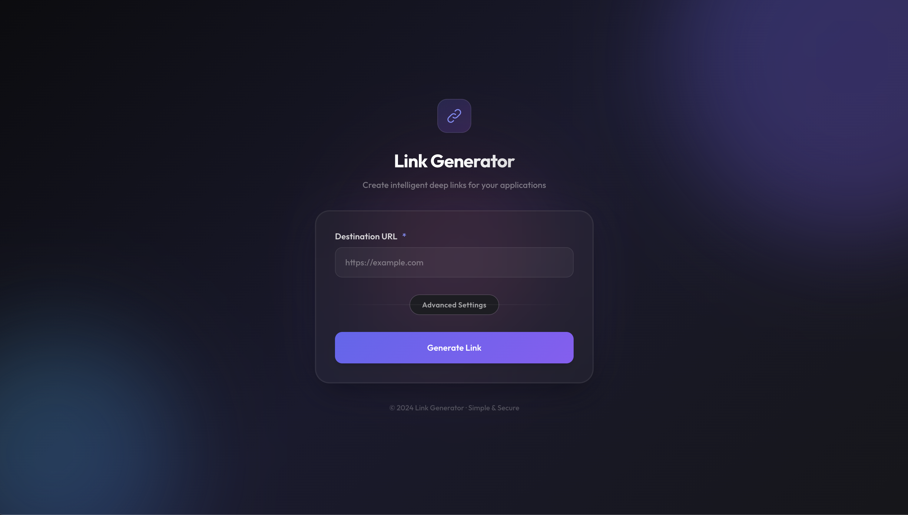
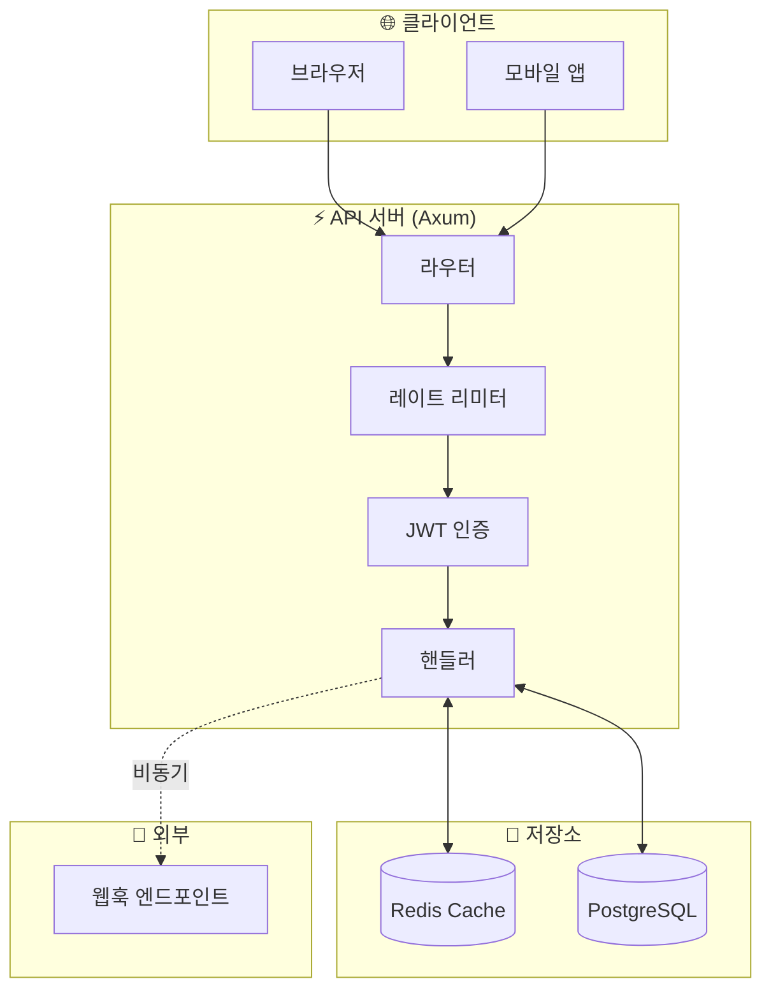
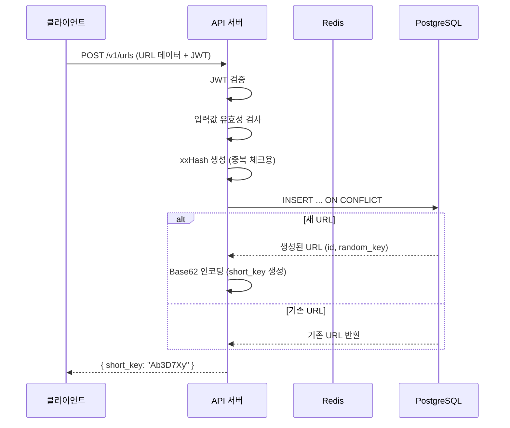
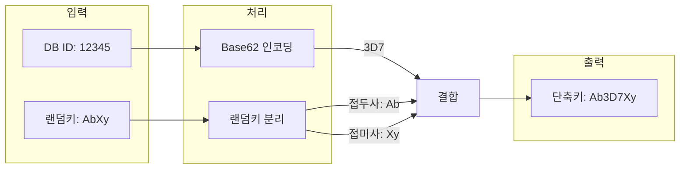
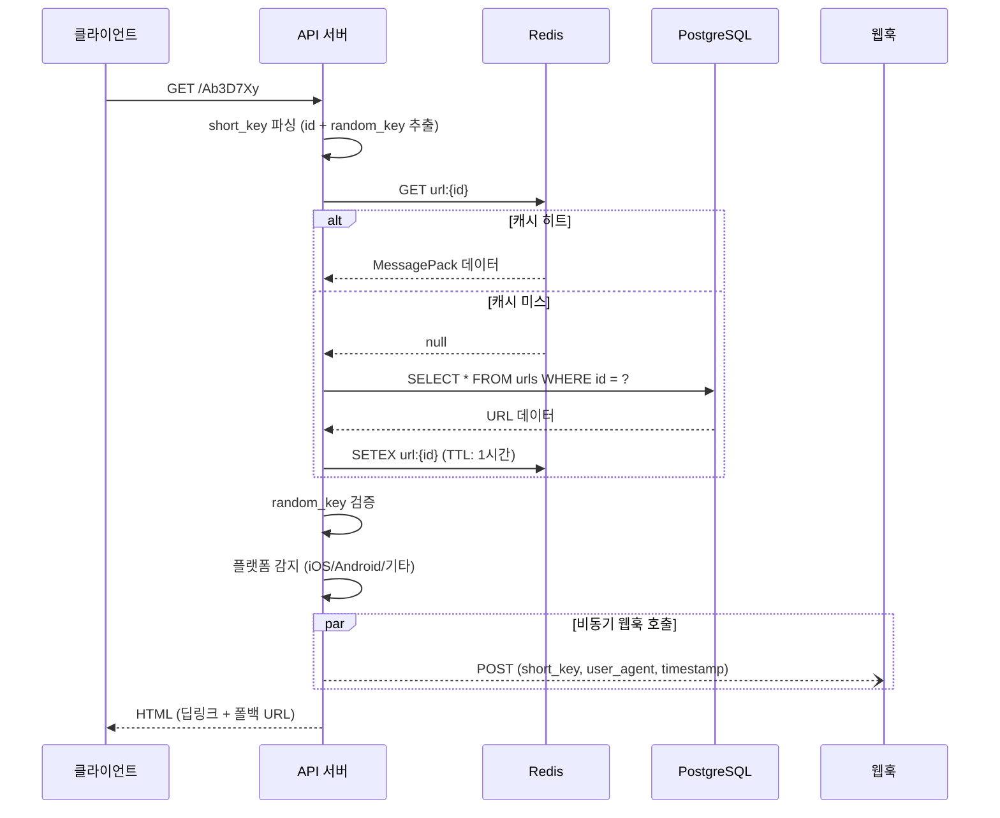
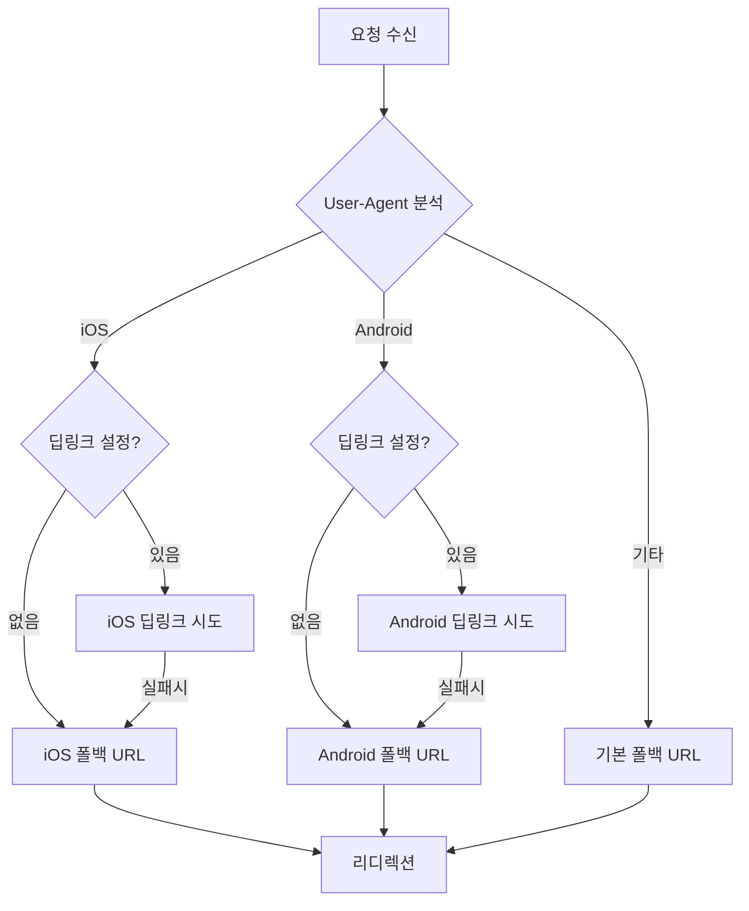
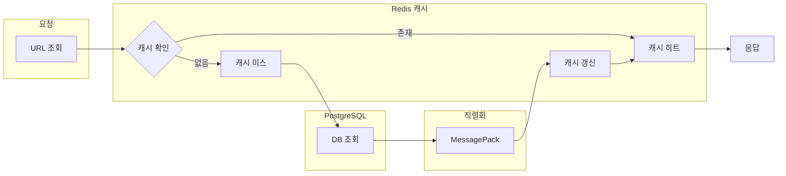

# URL 단축 서비스

[한국어](README.md) | [English](README.en.md)

🚀 **데모:** [https://u.lou2.kr](https://u.lou2.kr)



Rust로 개발된 고성능 URL 단축 서비스입니다. 딥 링크 처리, 플랫폼별 리디렉션, JWT 인증, 웹훅 알림을 지원합니다.

## 아키텍처



## 핵심 기술

| 영역 | 기술 | 설명 |
|------|------|------|
| 웹 프레임워크 | **Axum 0.8** | 비동기 HTTP 서버 |
| 데이터베이스 | **PostgreSQL + SQLx** | 타입 안전 쿼리 |
| 캐시 | **Redis + MessagePack** | 고속 직렬화 캐싱 |
| 인증 | **JWT** | 토큰 기반 인증 |
| 해싱 | **xxHash (xxh3_128)** | 중복 URL 감지 |
| 메모리 | **mimalloc** | 고성능 할당자 |

## URL 생성 플로우



### 단축키 생성 방식



**특징:**
- DB ID 기반으로 충돌 없음
- 랜덤 접두사/접미사로 순차 추측 방지
- 일관된 성능 (DB 크기 무관)

## URL 리디렉션 플로우



### 플랫폼별 리디렉션



## 캐싱 전략



**MessagePack 사용 이유:**
- JSON 대비 30-50% 작은 크기
- 빠른 직렬화/역직렬화
- 바이너리 포맷으로 Redis 저장 효율적

## 시작하기

### 사전 준비

- Rust 1.75+
- PostgreSQL
- Redis

### 실행

```bash
# 저장소 복제
git clone https://github.com/lee-lou2/url-shortener.git
cd url-shortener

# 환경 변수 설정
cp .env.example .env

# 실행
cargo run --release
```

### Docker

```bash
docker build -t url-shortener .
docker run -p 3000:3000 --env-file .env url-shortener
```

### 주요 환경 변수

| 변수 | 기본값 | 설명 |
|------|--------|------|
| `SERVER_PORT` | 3000 | 서버 포트 |
| `DB_HOST` | localhost | PostgreSQL 호스트 |
| `REDIS_HOST` | localhost | Redis 호스트 |
| `JWT_SECRET` | - | JWT 시크릿 (프로덕션 필수) |
| `CACHE_TTL_SECS` | 3600 | 캐시 TTL (초) |
| `RATE_LIMIT_PER_SECOND` | 10 | 초당 요청 제한 |
| `WEBHOOK_MAX_CONCURRENT` | 100 | 최대 동시 웹훅 수 |

## API

### `POST /v1/urls` - URL 생성

**요청:**
```json
{
  "defaultFallbackUrl": "https://example.com",
  "iosDeepLink": "myapp://path",
  "iosFallbackUrl": "https://apps.apple.com/app/myapp",
  "androidDeepLink": "myapp://path",
  "androidFallbackUrl": "https://play.google.com/store/apps/details?id=com.myapp",
  "webhookUrl": "https://webhook.example.com",
  "ogTitle": "제목",
  "ogDescription": "설명",
  "ogImageUrl": "https://example.com/image.jpg"
}
```

**응답:**
```json
{
  "message": "URL created successfully",
  "short_key": "Ab3D7Xy"
}
```

### `GET /{short_key}` - 리디렉션

단축 URL을 원본 URL로 리디렉션합니다.

## 프로젝트 구조

```
src/
├── main.rs           # 진입점
├── error.rs          # 에러 처리
├── api/              # HTTP 핸들러, 라우트, 미들웨어
├── config/           # 환경 설정, DB/Redis 연결
├── models/           # 데이터 모델, 리포지토리
└── utils/            # JWT, Base62, 랜덤 문자열
```

## 라이선스

MIT License
